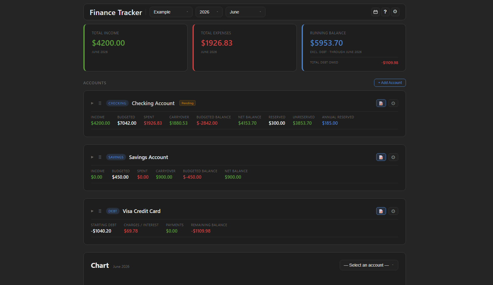
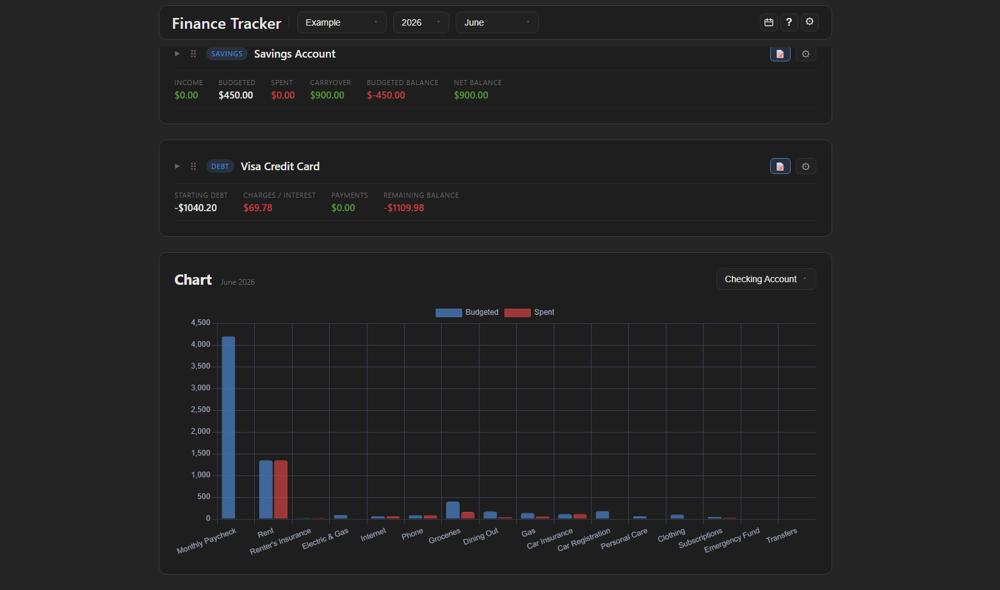

# Finance Tracker

A locally-hosted personal finance and budgeting app. Track income, expenses, savings, and debt across multiple accounts — all stored on your own machine, no accounts or internet connection required.




## Features

- Multiple account types: Checking, Savings, Cash, Investment, and Debt (credit cards, loans)
- Budget categories with folders, monthly limits, and pay-by dates
- Month-by-month navigation with carryover balances
- Transfers between accounts
- Reserve categories for funds set aside within an account
- Annual expense tracking
- Budget vs. spent bar charts per account
- PDF export
- Multiple databases — switch between them from the toolbar
- Comes loaded with an example database so you can explore before entering your own data

## Requirements

- Python 3.8 or higher
- A modern web browser

## Installation

```bash
# 1. Clone the repository
git clone https://github.com/YOUR_USERNAME/YOUR_REPO_NAME.git
cd YOUR_REPO_NAME

# 2. Create and activate a virtual environment
python -m venv venv

# Windows
venv\Scripts\activate

# macOS / Linux
source venv/bin/activate

# 3. Install dependencies
pip install -r requirements.txt
```

## Running the App

```bash
python app.py
```

Then open your browser and go to: **http://localhost:5000**

The app opens with an example database pre-loaded so you can explore the layout right away. When you're ready, create your own database from the toolbar at the top of the page.

## License

MIT License — see [LICENSE](LICENSE) for details.
